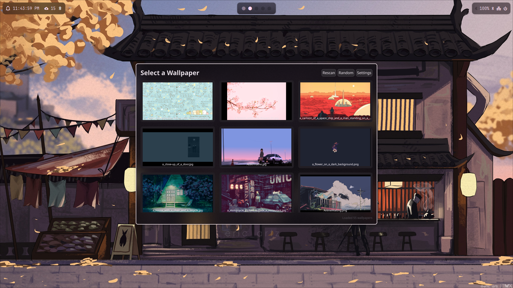
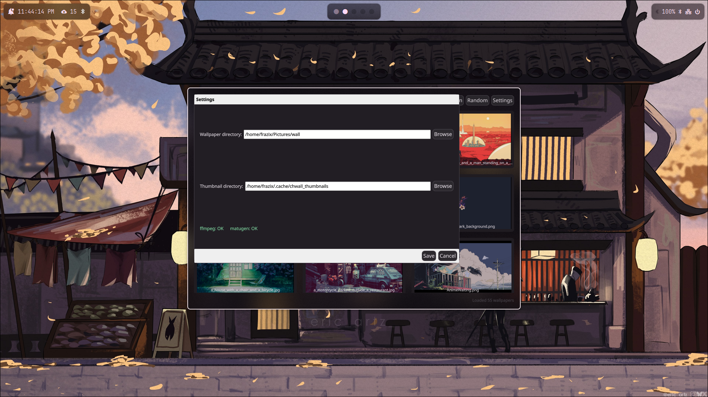

# QuickShell Wallpaper Changer

A fast wallpaper changer for [matugen](https://github.com/InioX/matugen) built with QuickShell. Features thumbnail caching for faster loading and seamless color scheme generation.

<details>
<summary>Preview Images</summary>

### Main Interface


### Settings Dialog


</details>

## Features

- 🖼️ Visual grid interface with thumbnail previews
- ⚡ Fast thumbnail caching with ffmpeg
- 🎨 Automatic wallpaper application via matugen
- 🎲 Random wallpaper selection
- ⚙️ Configurable wallpaper and cache directories
- 💾 Persistent settings

## Dependencies

- [QuickShell](https://github.com/outfoxxed/quickshell) (required)
- [matugen](https://github.com/InioX/matugen) (for wallpaper application)
- [ffmpeg](https://ffmpeg.org/) (for thumbnail generation)

## Quick Start

```bash
# Run the application
quickshell -c shell.qml
```

**Default directories:**
- Wallpapers: `~/Pictures/wall`
- Thumbnails: `~/.cache/chwall_thumbnails`

**Controls:**
- Click wallpaper to apply
- Random/Rescan/Settings buttons
- ESC to close

## Supported Formats

JPG, JPEG, PNG, WebP, BMP

## Troubleshooting

- **No wallpapers found**: Check if `~/Pictures/wall` exists and contains images
- **No thumbnails**: Install ffmpeg for faster loading
- **Can't apply wallpaper**: Install matugen